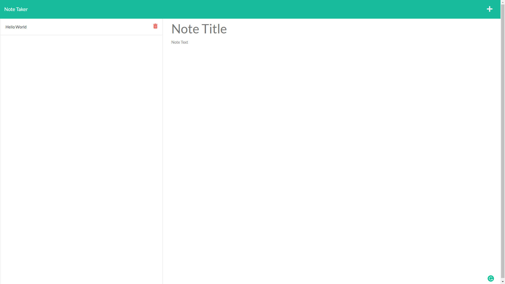

# Note Taker

 

## Description

- My motivation behind this project was to use what I learned about express and routing to complete an application that allows a user to create, save, and retrieve notes. 
- I built this project to further enhance my understanding of Node.js, Express.js, back-end development, and routing.
- This project aimed to take starter code containing all of the front-end assets and develop the back-end that allowed the front-end to function properly.
- Through this project, I learned how to use Express.js, how routing works, how to connect the front-end to the back-end, associated functionality, and also Heroku deployment.

## Table of Contents

1. [Installation](#installation)
2. [Usage](#usage)
3. [Demonstration](#demonstration)
4. [License](#license)
5. [How to Contribute](#how-to-contribute)
6. [Questions?](#questions)

## Installation

This application is deployed to Heroku, and you can access it [here](https://richard-zhang-note-taker.herokuapp.com/).

Alternatively, you can clone this repo. To install dependencies, open in [Visual Studio Code](https://code.visualstudio.com/), and in the terminal (requires [Node.js](https://nodejs.org/en/)) run: 

      npm install 

## Usage

This application is deployed to Heroku, and you can access it [here](https://richard-zhang-note-taker.herokuapp.com/).

Alternatively, once the application is opened in Visual Studio Code, or navigated to using Git Bash (or similar command-line tool), run: 

      npm start 

The application is written to run on port 3001, but you can change the port number by altering it in the server.js file. 

##  Demonstration

This application is deployed to Heroku, and you can access it [here](https://richard-zhang-note-taker.herokuapp.com/).

Some screenshots:

## License

This application is covered under the [MIT](https://opensource.org/licenses/MIT) license

----------------------------------------------------------------

  Copyright © 2022 Richard Zhang

  Permission is hereby granted, free of charge, to any person obtaining a copy of this software and associated documentation files (the "Software"), to deal in the Software without restriction, including without limitation the rights to use, copy, modify, merge, publish, distribute, sublicense, and/or sell copies of the Software, and to permit persons to whom the Software is furnished to do so, subject to the following conditions:
  
  The above copyright notice and this permission notice shall be included in all copies or substantial portions of the Software.
  
  THE SOFTWARE IS PROVIDED "AS IS", WITHOUT WARRANTY OF ANY KIND, EXPRESS OR IMPLIED, INCLUDING BUT NOT LIMITED TO THE WARRANTIES OF MERCHANTABILITY, FITNESS FOR A PARTICULAR PURPOSE AND NONINFRINGEMENT. IN NO EVENT SHALL THE AUTHORS OR COPYRIGHT HOLDERS BE LIABLE FOR ANY CLAIM, DAMAGES OR OTHER LIABILITY, WHETHER IN AN ACTION OF CONTRACT, TORT OR OTHERWISE, ARISING FROM, OUT OF OR IN CONNECTION WITH THE SOFTWARE OR THE USE OR OTHER DEALINGS IN THE SOFTWARE.

  ----------------------------------------------------------------

## How to Contribute

If you want to contribute to this project and make it better, your help is very welcome. This was a school project, so anything you want to do to it, go for it. You can also contact me directly through the links below.

## Questions?

Have any questions? Here is a list of my links:
- GitHub: [RichardZhang01](https://github.com/RichardZhang01)
- Email: richardzhiyuanzhang@gmail.com

